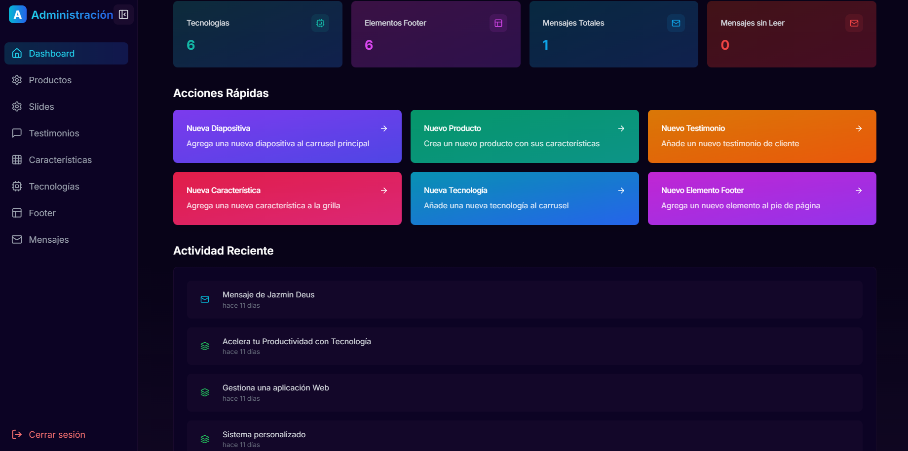
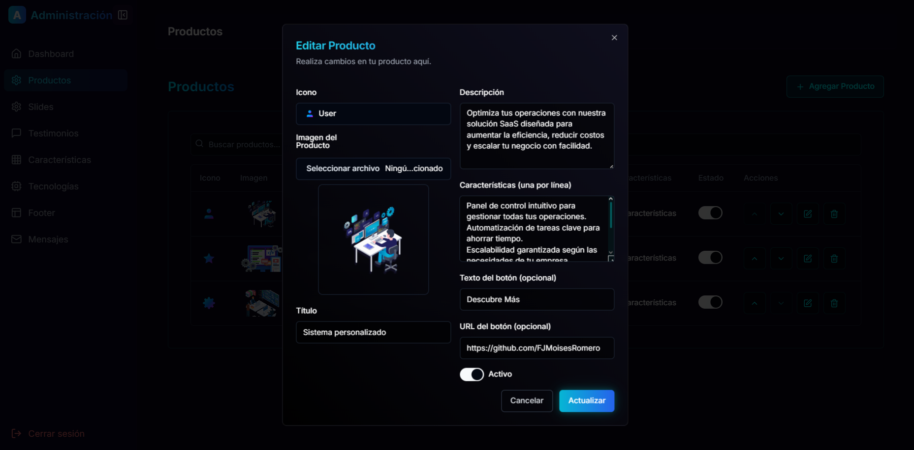
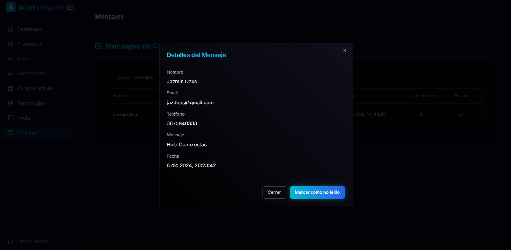

# SaaS Landing Page + CMS 🌐

A **SaaS Landing Page** with an integrated **Content Management System (CMS)** that allows you to easily manage product descriptions, testimonials, features, and receive customer messages. This project provides a **user-friendly interface** to handle content updates and engage with potential customers seamlessly. 🚀

## Features ⚙️

- **Manage Product Descriptions** 📑: Easily update product information and details.
- **Customer Testimonials** 🗣️: Add and manage testimonials from your satisfied customers.
- **Feature Management** 🌟: Display key features of your service or product.
- **Customer Messages** 💬: Receive and manage messages from potential customers through a contact form.
- **Mobile Responsive** 📱: Optimized for mobile and desktop views.

## Technologies Used 🛠️

- **Frontend:** Next.js, TypeScript, Tailwind CSS.
- **Backend:** Custom CMS for managing content.
- **Database:** Prisma for ORM with a connected database.

## Installation and Running 🚀

1. Clone the repository:
   ```bash
   git clone https://github.com/FJMoisesRomero/SaaS-Landing-Page-CMS.git
   cd SaaS-Landing-Page-CMS
   
2. Install dependencies:
    ```bash
    npm install
    
3. Configure environment variables:
Create a .env file in the root of the project and add necessary configuration variables.

4. Run the development server:
    ```bash
    npm run dev
    
5. Access the application at http://localhost:3000.

## Community Contribution 🤝

As a contribution to the community, an **early version** of this project has been uploaded for **free use**. This version allows users to explore the features and functionalities, and provides a foundation for further development. Feel free to fork, modify, and enhance it as needed!


## Screenshots 📸







